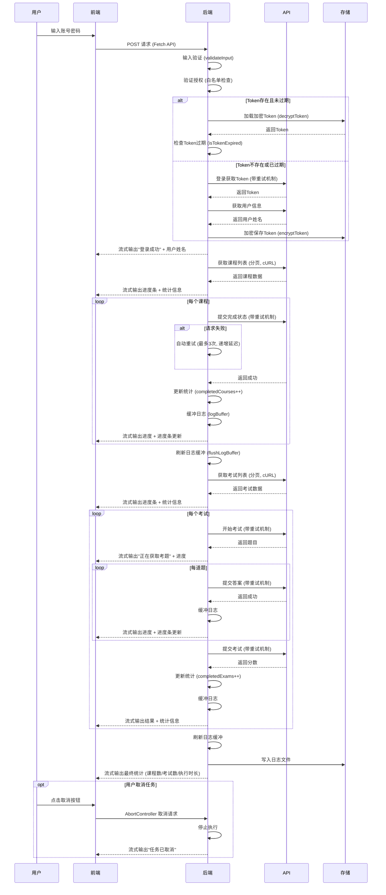

# 智慧学习助手

> 一个高效的自动化学习平台任务执行系统，支持自动完成课程学习和考试任务


## 功能特性

### 前端界面

- **现代化设计** - Bootstrap 5 响应式布局，完美适配桌面和移动设备
- **主题切换** - 支持深色/浅色模式，一键切换
- **实时反馈** - 流式数据接收，实时显示任务执行状态和进度
- **进度可视化** - 精美进度条，支持渐变、动画效果，实时显示完成百分比
- **实时统计** - 动态显示已完成课程数、考试数、执行时长
- **任务控制** - 支持随时取消正在执行的任务

### 后端核心

- **课程自动化** - 自动识别并完成文件类、视频类、混合类课程
- **考试自动化** - 自动获取考题、答题、提交，确保考试通过
- **分页支持** - 自动分页获取所有课程和考试数据
- **Token 管理** - 自动获取、验证、刷新 API 令牌
- **Token 加密** - 使用 AES-256-CBC 加密算法安全存储
- **智能重试** - API 请求失败时自动重试，递增延迟策略
- **日志系统** - 详细的操作日志，支持按日期分割
- **用户授权** - 白名单机制，防止未授权访问

## 技术栈

| 类型 | 技术 |
|------|------|
| 后端 | PHP 7.2+ |
| 前端 | HTML5, CSS3, JavaScript (ES6+) |
| UI 框架 | Bootstrap 5 |
| 图标库 | Font Awesome |
| 通信方式 | Fetch API + Server-Sent Events |
| HTTP 客户端 | cURL |
| 加密算法 | AES-256-CBC |

## 快速开始

### 环境要求

- Web 服务器（Nginx / Apache）
- PHP >= 7.2（需启用 cURL 扩展）
- 支持流式输出的 PHP 配置

### 安装部署

1. **克隆仓库**
   ```bash
   git clone git@github.com:zhaohe574/aq.git
   cd aq
   ```

2. **配置授权用户**
   
   编辑 `config.php`，修改授权用户列表：
   ```php
   'authorized_users' => [
       'USERNAME_1',  // 添加授权用户
       'USERNAME_2',
   ],
   ```

3. **设置目录权限**
   ```bash
   chmod -R 755 .
   chmod -R 777 logs errs
   chmod 666 tokens.json  # 如果文件已存在
   ```

4. **访问系统**
   - 任务执行：`http://your-domain/index.html`
   - 日志查看：`http://your-domain/log.html`

## 项目结构

```
aq/
├── index.html              # 任务执行主页面
├── log.html                # 日志查看器页面
├── process.php             # 后端核心处理逻辑
├── config.php              # 系统配置文件
├── get_file_list.php       # 获取日志文件列表 API
├── get_log_content.php     # 获取日志内容 API
├── tokens.json             # Token 存储文件（自动生成，已加密）
├── .htaccess               # Apache 配置
├── nginx.htaccess          # Nginx 配置参考
│
├── css/                    # 样式文件
│   ├── bootstrap.min.css
│   └── all.min.css         # Font Awesome
│
├── js/                     # JavaScript 文件
│   └── bootstrap.bundle.min.js
│
├── webfonts/               # Font Awesome 字体
│
├── logs/                   # 操作日志目录
│   └── log_YYYY-MM-DD.txt
│
└── errs/                   # 错误日志目录
    └── error_YYYY-MM-DD.txt
```

## 配置说明

所有配置项集中在 `config.php` 文件中：

### API 请求配置

```php
'api_timeout' => 120,        // 请求超时时间（秒）
'api_max_retries' => 3,      // 最大重试次数
'api_retry_delay' => 2,      // 重试延迟基数（秒）
```

重试延迟采用递增策略：第 1 次重试等待 2 秒，第 2 次 4 秒，第 3 次 6 秒。

### 分页配置

```php
'page_size' => 10,           // 每页数据条数
```

### 考试配置

```php
'exam_time_limit' => 1800,   // 考试时间限制（秒）
'exam_answer_delay' => 30,   // 答题间隔（秒）
```

### 安全配置

```php
'token_expire_hours' => 24,  // Token 过期时间（小时）
'use_curl' => true,          // 是否使用 cURL
```

### 日志配置

```php
'log_buffer_size' => 100,    // 日志缓冲区大小
'log_level' => 'info',       // 日志级别：debug/info/warning/error
```

## 使用指南

### 执行任务

1. 打开 `index.html` 页面
2. 输入学习平台账号和密码
3. 点击「开始执行」按钮
4. 查看实时执行进度和统计信息
5. 任务完成后显示最终统计

### 查看日志

1. 打开 `log.html` 页面
2. 左侧选择「操作日志」或「错误日志」标签
3. 点击日志文件查看详细内容
4. 使用搜索框过滤日志内容

## 系统架构

### 执行流程

```
用户输入 → 验证授权 → 登录获取Token → 处理课程 → 处理考试 → 输出统计
```

### 数据流



### 组件交互

```
┌─────────────┐     HTTP/SSE      ┌─────────────┐     API请求      ┌─────────────┐
│   前端界面   │ ◄──────────────► │  后端处理    │ ◄──────────────► │ 学习平台API  │
│ index.html  │                   │ process.php │                   │             │
└─────────────┘                   └─────────────┘                   └─────────────┘
                                        │
                                        ▼
                                  ┌─────────────┐
                                  │  本地存储    │
                                  │ tokens.json │
                                  │ logs/ errs/ │
                                  └─────────────┘
```

## 故障排除

### API 请求超时

- 增加 `api_timeout` 配置值
- 检查网络连接是否稳定

### 重试失败

- 检查 API 服务器状态
- 查看错误日志获取详细信息
- 增加 `api_max_retries` 配置值

### 权限错误

```bash
# 检查目录权限
ls -la logs errs

# 设置正确权限
chmod -R 777 logs errs
chmod 666 tokens.json
```

### Token 失效

- 系统会自动检测并重新登录
- 可手动删除 `tokens.json` 强制重新登录

## 安全注意事项

1. **用户授权** - 必须配置 `authorized_users` 白名单
2. **Token 加密** - 使用 AES-256-CBC 加密存储敏感信息
3. **敏感文件** - `tokens.json` 已加入 `.gitignore`
4. **网络安全** - 建议使用 HTTPS 部署
5. **日志安全** - 定期清理或限制日志目录访问

## 免责声明

本系统仅用于**学习和技术研究目的**。使用者必须：

1. 遵守所在地的相关法律法规
2. 遵守学习平台的用户协议和服务条款
3. 不得用于任何商业用途
4. 自行承担使用本系统的一切风险

**开发者不对因使用本系统而导致的任何问题承担责任。**

## 许可证

本项目采用 [MIT](LICENSE) 许可证。

---

<p align="center">
  <b>⭐ 如果这个项目对你有帮助，请给个 Star ⭐</b>
</p>
