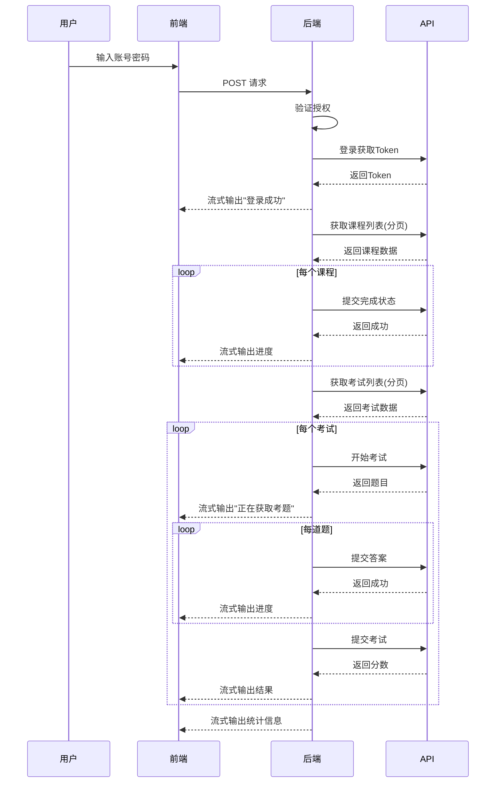

# 智慧学习助手

> 一个高效的自动化学习平台任务执行系统，支持自动完成课程学习和考试任务


## 📋 目录

- [功能特性](#-功能特性)
- [技术栈](#-技术栈)
- [快速开始](#-快速开始)
- [安装部署](#-安装部署)
- [配置说明](#-配置说明)
- [使用指南](#-使用指南)
- [系统架构](#-系统架构)
- [文件结构](#-文件结构)
- [故障排除](#-故障排除)
- [安全注意事项](#-安全注意事项)
- [更新日志](#-更新日志)
- [技术支持](#-技术支持)

---

## ✨ 功能特性

### 🎨 前端界面

- **现代化设计** - 采用 Bootstrap 5 框架，响应式布局，完美适配桌面和移动设备
- **科幻主题** - 独特的动态星空背景和流畅动画效果
- **主题切换** - 支持深色/浅色模式，一键切换，保护视力
- **实时反馈** - 流式数据接收，实时显示任务执行状态和进度
- **高级进度条** - 精美的进度条设计，支持渐变、动画、脉冲效果，实时显示任务完成百分比
- **实时统计** - 动态显示已完成课程数、已完成考试数、执行时长等统计信息
- **任务取消** - 支持随时取消正在执行的任务，优雅停止
- **交互优化** - 加载动画、平滑滚动、消息逐字打印等细节优化
- **本地存储** - 自动保存用户名和主题偏好

### ⚙️ 后端核心

- **自动化处理** - 自动识别并完成文件类、视频类、混合类课程
- **智能考试** - 自动获取考题、答题、提交，确保考试通过
- **分页支持** - 自动分页获取所有课程和考试数据，不遗漏任何任务
- **Token管理** - 自动获取、验证、刷新API令牌，避免重复登录
- **Token加密** - 使用 AES-256-CBC 加密算法安全存储Token和密码
- **Token过期检查** - 自动检测Token过期（24小时），过期自动重新登录
- **重试机制** - API请求失败时自动重试（最多3次），递增延迟策略
- **性能优化** - 使用 cURL 替代 file_get_contents，提供更好的错误处理
- **日志缓冲** - 批量写入日志，提高性能（缓冲区大小：100条）
- **流式响应** - 使用 Server-Sent Events 实时推送任务状态
- **日志系统** - 详细的操作日志记录，支持按日期分割和大小轮转
- **日志优化** - 日志分割线格式简化，日志页面宽度优化（最大1800px）
- **日志查看器** - 独立的日志查看页面，支持搜索、高亮、主题切换
- **安全授权** - 用户白名单机制，防止未授权访问
- **输入验证** - 严格的用户名和密码验证，防止注入攻击
- **路径安全** - 使用 realpath() 规范化路径，防止目录遍历攻击

---

## 🛠️ 技术栈

| 技术 | 说明 |
|------|------|
| **后端** | PHP 7.2+ |
| **前端** | HTML5, CSS3, JavaScript (ES6+) |
| **UI框架** | Bootstrap 5 |
| **图标库** | Font Awesome |
| **通信方式** | Fetch API + Server-Sent Events |
| **HTTP客户端** | cURL (可选 file_get_contents) |
| **加密算法** | AES-256-CBC (Token加密) |
| **配置管理** | 独立配置文件 (config.php) |

---

## 🚀 快速开始

### 环境要求

- Web服务器（Nginx / Apache）
- PHP >= 7.2
- 支持流式输出的PHP配置

### 一键部署

1. **克隆仓库**
   ```bash
   git clone git@github.com:zhaohe574/aq.git
   cd aq
   ```

2. **配置授权用户**
   
   编辑 `process.php`，在 `$config` 数组中添加授权用户：
   ```php
   'authorized_users' => ['YOUR_USERNAME_1', 'YOUR_USERNAME_2']
   ```

3. **设置目录权限**
   ```bash
   chmod -R 755 .
   chmod -R 777 logs errs
   ```

4. **访问系统**
   - 任务执行：`http://your-domain/index.html`
   - 日志查看：`http://your-domain/log.html`

---

## 📦 安装部署

### 详细部署步骤

#### 1. 上传文件

将所有项目文件上传到Web服务器目录（如 `/var/www/html` 或 `htdocs`）

#### 2. 配置PHP路径

确保 `.user.ini` 中的 `open_basedir` 配置允许访问项目目录

#### 3. 配置授权用户

打开 `process.php`，找到配置数组：

```php
private $config = [
    // ... 其他配置
    'authorized_users' => [
        'USERNAME_1',  // 添加授权用户（大写）
        'USERNAME_2',
        // ...
    ],
];
```

**注意**：用户名必须是大写格式（通常是身份证号）

#### 4. 设置目录权限

```bash
# Linux/Unix 系统
chmod -R 755 .           # 所有文件可读可执行
chmod -R 777 logs errs   # 日志目录可写
chmod 666 tokens.json    # Token文件可写（如果已存在）
```

#### 5. 验证部署

- 访问 `index.html` 应该能看到登录界面
- 访问 `log.html` 应该能看到日志查看器
- 检查 `logs` 和 `errs` 目录是否可写

---

## ⚙️ 配置说明

所有配置项都在 `config.php` 文件中（v3.0+），或 `process.php` 的 `$config` 数组中（旧版本），可根据实际需求调整：

### API请求配置

```php
'api_timeout' => 120,        // 请求超时时间（秒），默认120秒
'api_max_retries' => 3,      // 最大重试次数，默认3次
'api_retry_delay' => 2,      // 重试延迟基数（秒）
```

**说明**：
- `api_timeout`: 如果API响应较慢，可适当增加（如180秒）
- `api_max_retries`: 网络不稳定时可增加到5次
- 重试延迟采用递增策略：第1次重试等待2秒，第2次4秒，第3次6秒

### 分页配置

```php
'page_size' => 10,           // 分页大小，默认10条
```

**说明**：
- 根据API性能和服务器响应速度调整
- 建议范围：10-100
- 值越大，单次请求数据越多，但可能响应更慢

### 考试配置

```php
'exam_time_limit' => 1800,   // 考试时间限制（秒），默认30分钟
'exam_answer_delay' => 30,   // 答题间隔（秒），默认30秒
```

**说明**：
- `exam_time_limit`: 考试总时长，用于计算剩余时间
- `exam_answer_delay`: 每道题的答题间隔，用于模拟真实答题速度

### 安全配置

```php
'use_token_encryption' => true,    // 是否启用Token加密，默认true
'token_expire_hours' => 24,        // Token过期时间（小时），默认24小时
'use_curl' => true,                 // 是否使用cURL，默认true
```

### 性能配置

```php
'log_buffer_size' => 100,          // 日志缓冲区大小，默认100条
```

### 其他配置

```php
'api_base_url' => 'http://api.example.com/api',  // API基础地址
'token_file' => 'tokens.json',                   // Token存储文件
'log_dir' => 'logs',                              // 常规日志目录
'err_log_dir' => 'errs',                          // 错误日志目录
```

---

## 📖 使用指南

### 执行任务

1. **打开任务执行页面**
   - 在浏览器中访问 `index.html`

2. **登录系统**
   - 输入学习平台账号（会自动转换为大写）
   - 输入密码
   - 点击"开始执行"按钮

3. **查看执行进度**
   - 系统会实时显示任务执行状态
   - 包括：登录状态、课程完成情况、考试进度等
   - 每条消息都会实时更新

4. **查看执行结果**
   - 任务完成后会显示统计信息：
     - 执行时长
     - 完成课程数量
     - 完成考试数量

### 查看日志

1. **打开日志查看器**
   - 在浏览器中访问 `log.html`
   - 或从任务执行页面点击"查看日志"链接

2. **选择日志类型**
   - 在左侧标签页选择"操作日志"或"错误日志"

3. **浏览日志文件**
   - 左侧显示按日期排序的日志文件列表
   - 点击文件名查看详细内容

4. **搜索日志内容**
   - 使用顶部搜索框输入关键词
   - 支持高亮显示匹配内容
   - 点击"清除"按钮取消搜索

5. **切换主题**
   - 点击右上角主题切换按钮
   - 支持深色/浅色模式

---

## 🏛️ 系统架构

### 架构图

```
┌─────────────┐
│   用户界面   │  (index.html / log.html)
└──────┬──────┘
       │ HTTP/AJAX
       │ Server-Sent Events
┌──────▼──────┐
│  后端处理    │  (process.php)
└──────┬──────┘
       │ API请求
       │ (带重试机制)
┌──────▼──────┐
│ 学习平台API  │
└─────────────┘
```

### 执行流程

1. **用户认证** - 验证用户是否在授权列表
2. **登录获取Token** - 自动登录并获取API访问令牌
3. **获取课程列表** - 分页获取所有未完成课程
4. **完成课程任务** - 根据课程类型自动完成
5. **获取考试列表** - 分页获取所有考试
6. **完成考试任务** - 自动获取考题、答题、提交
7. **输出统计信息** - 显示执行结果和统计数据

### 数据流



---

## 📁 文件结构

```
aq/
├── css/                          # 样式文件
│   ├── all.min.css              # Font Awesome 图标库
│   └── bootstrap.min.css        # Bootstrap 5 样式
│
├── js/                           # JavaScript 文件
│   └── bootstrap.bundle.min.js  # Bootstrap 5 脚本
│
├── logs/                         # 常规日志目录（自动创建）
│   └── log_YYYY-MM-DD.txt       # 按日期分割的日志文件
│
├── errs/                         # 错误日志目录（自动创建）
│   └── error_YYYY-MM-DD.txt     # 按日期分割的错误日志
│
├── webfonts/                     # Font Awesome 字体文件
│
├── index.html                    # 任务执行主页面
├── log.html                      # 日志查看器页面
│
├── process.php                   # 后端核心处理逻辑
├── config.php                    # 配置文件（v3.0+）
├── get_file_list.php             # 获取日志文件列表API
├── get_log_content.php           # 获取日志内容API代理
│
├── doc/                          # 文档目录
│   ├── 项目分析报告.md           # 项目分析报告
│   └── 优化实施总结.md           # 优化实施总结
│
├── .gitignore                    # Git 忽略配置
├── .user.ini                     # PHP 路径限制配置
├── README.md                     # 项目说明文档
│
└── tokens.json                   # Token存储文件（已加入.gitignore，已加密）
```

---

## 🔧 故障排除

### 常见问题

#### 1. API请求超时

**症状**：经常出现"请求超时"错误

**解决方案**：
- 增加 `api_timeout` 配置值（如改为180秒）
- 检查网络连接是否稳定
- 确认API服务器是否正常运行

#### 2. 重试失败

**症状**：所有重试都失败，最终返回错误

**解决方案**：
- 检查API服务器状态
- 查看错误日志获取详细错误信息
- 增加 `api_max_retries` 配置值
- 检查网络连接和防火墙设置

#### 3. 数据不完整

**症状**：部分课程或考试没有被处理

**解决方案**：
- 检查 `page_size` 配置是否合适
- 查看日志确认是否有错误信息
- 确认API返回的数据格式是否正确

#### 4. 日志文件过大

**症状**：日志文件占用大量磁盘空间

**解决方案**：
- 系统会自动轮转超过10MB的日志文件
- 可以手动删除旧的日志文件
- 建议定期清理历史日志

#### 5. 权限错误

**症状**：无法写入日志或Token文件

**解决方案**：
```bash
# 检查目录权限
ls -la logs errs

# 设置正确权限
chmod -R 777 logs errs
chmod 666 tokens.json
```

#### 6. Token失效

**症状**：提示Token失效，需要重新登录

**解决方案**：
- 系统会自动检测Token过期（24小时）并重新登录获取新Token
- 如果频繁失效，检查 `token_expire_hours` 配置
- 可以手动删除 `tokens.json` 文件强制重新登录

#### 7. Token加密问题

**症状**：Token无法解密或读取失败

**解决方案**：
- 检查 `use_token_encryption` 配置是否正确
- 如果加密密钥丢失，删除 `tokens.json` 文件重新登录
- 系统会自动迁移未加密的Token到加密格式

---

## ⚠️ 安全注意事项

### 1. 用户授权

- **必须配置** `authorized_users` 白名单
- 只添加信任的用户账号
- 定期审查授权用户列表

### 2. 敏感信息保护

- `tokens.json` 包含用户密码和Token，已加入 `.gitignore`
- **Token加密存储** - v3.0+ 版本使用 AES-256-CBC 加密算法保护敏感信息
- 确保服务器文件系统安全
- 不要将敏感文件提交到版本控制系统
- 定期检查加密密钥的安全性

### 3. 日志安全

- 日志文件可能包含操作详情
- 建议定期清理或加强访问控制
- 可以配置Web服务器禁止直接访问日志目录

### 4. 网络安全

- 建议使用HTTPS部署
- 配置防火墙限制访问来源
- 定期更新系统和依赖

### 5. 服务器安全

- 保持PHP和Web服务器最新版本
- 配置适当的文件权限
- 使用强密码和SSH密钥认证

---

## 🆕 更新日志

### v3.0 (当前版本) - 2025-12-26

#### 安全性增强
- 🔒 Token加密存储 - 使用 AES-256-CBC 加密算法保护敏感信息
- 🔒 Token过期检查 - 自动检测并刷新过期Token（24小时有效期）
- 🔒 输入验证增强 - 严格的用户名和密码验证规则
- 🔒 路径安全检查 - 使用 realpath() 防止目录遍历攻击

#### 性能优化
- ⚡ 使用 cURL 替代 file_get_contents - 更好的错误处理和HTTP状态码获取
- ⚡ 日志缓冲区优化 - 批量写入日志，提高性能（缓冲区：100条）

#### 用户体验提升
- ✨ 高级进度条 - 精美的渐变、动画、脉冲效果，实时显示完成百分比
- ✨ 实时统计面板 - 动态显示已完成课程数、已完成考试数、执行时长
- ✨ 任务取消功能 - 支持随时取消正在执行的任务
- ✨ 用户姓名显示 - 登录成功后自动获取并显示用户姓名
- ✨ 日志分割线优化 - 简化日志分割线格式，提升可读性
- ✨ 日志页面宽度优化 - 最大宽度从1200px增加到1800px

#### 前端优化
- 🎨 使用 Fetch API 替代 XMLHttpRequest - 更现代的API
- 🎨 前端错误重试机制 - 网络错误时自动重试（最多3次）
- 🎨 进度条样式全面优化 - 多层阴影、渐变、动画效果
- 🎨 深色模式优化 - 改进深色模式下的颜色搭配和视觉效果
- 🎨 响应式设计增强 - 完善的移动端适配

#### 代码质量
- 📝 配置分离 - 创建独立的 config.php 配置文件
- 📝 自定义异常类 - AutoLearnException 统一异常处理
- 📝 代码重复消除 - 合并重复方法，提高可维护性
- 📝 错误处理改进 - 更详细的错误信息和错误代码

### v2.0 - 2025-12-17

#### 新增功能
- ✨ 智能重试机制，提高API请求成功率
- ✨ 分页支持，自动获取所有课程和考试数据
- ✨ 日志查看器页面，方便查看和管理日志
- ✨ 考试获取考题时的进度提示

#### 问题修复
- 🐛 修复课程类型判断逻辑错误（使用else if替代多个if）
- 🐛 修复日志目录创建不完整的问题
- 🐛 修复分页数据遗漏问题

#### 性能优化
- ⚡ 优化流式输出性能，减少带宽占用（填充从4KB减少到512B）
- ⚡ 优化延迟策略，提高响应速度
- ⚡ 合并重复代码，减少代码量约60行

#### 代码质量
- 🔒 添加文件锁机制，防止并发写入冲突
- 📝 统一课程完成方法，提高代码可维护性
- ⚙️ 新增多个配置项，提高系统灵活性
- 📝 改进错误信息提示，提供更详细的错误信息

### v1.0

- 🎉 初始版本发布
- 基础课程和考试自动化功能
- 流式响应和实时进度显示
- 日志记录系统

---

## 📞 技术支持

### 获取帮助

- **GitHub Issues**: [提交问题](https://github.com/zhaohe574/aq/issues)
- **仓库地址**: `git@github.com:zhaohe574/aq.git`

### 贡献代码

欢迎提交 Pull Request 来改进项目！

### 反馈建议

如有任何问题或建议，请通过 GitHub Issues 反馈。

---

## 📜 免责声明

**重要提示**：

本系统仅用于**学习和技术研究目的**。使用者必须：

1. 遵守所在地的相关法律法规
2. 遵守学习平台的用户协议和服务条款
3. 不得用于任何商业用途
4. 自行承担使用本系统的一切风险

**开发者不对因使用本系统而导致的任何直接或间接问题承担责任。**

---

## 📄 许可证

本项目采用 MIT 许可证。详情请参阅 LICENSE 文件。

---

<div align="center">

**⭐ 如果这个项目对你有帮助，请给个 Star ⭐**

Made with ❤️ by [zhaohe574](https://github.com/zhaohe574)

</div>
