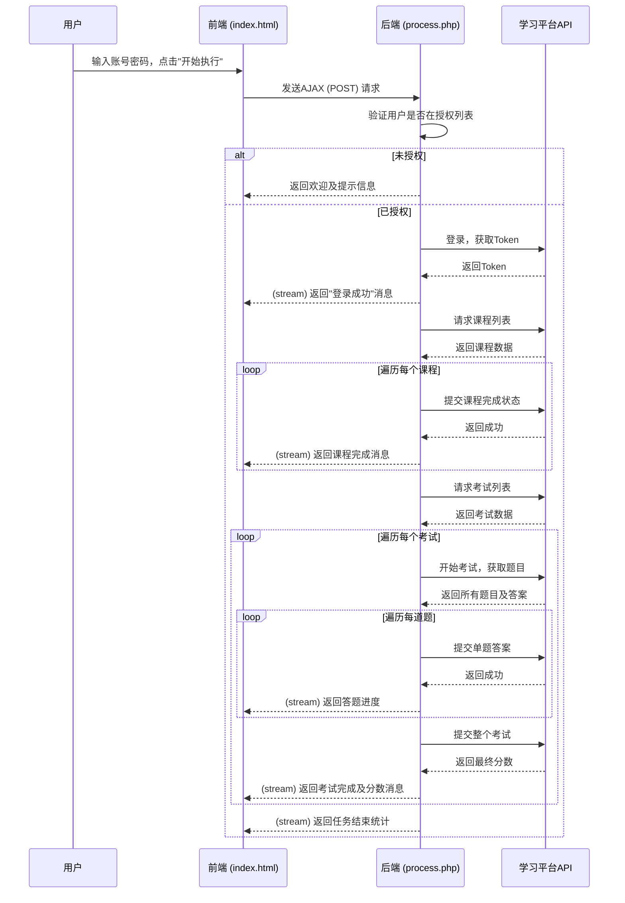

# 智慧学习助手 自动化学习系统


**智慧学习助手** 是一个高效的自动化学习平台任务执行系统，旨在自动完成指定学习平台上的课程学习和考试任务。它拥有一个充满科技感的现代化Web界面，能够提供实时的任务执行反馈。

---

### ✨ 功能亮点

本系统融合了美观的前端界面和强大的后端自动化能力。

#### 🚀 前端 (UI)
- **现代化设计**: 采用 Bootstrap 5 框架，界面美观、响应式，完美适配桌面和移动设备。
- **动态科幻主题**: 独特的科幻风格，包含动态星空背景和流畅的动画效果。
- **深色/浅色模式**: 一键切换主题，适应不同光线环境，保护您的视力。
- **实时进度反馈**: 通过流式数据接收，实时在前端展示每一项任务的执行状态，过程清晰可见。
- **用户体验优化**: 包含加载动画、平滑滚动、消息逐字打印等效果，提升了整体操作体验。
- **本地化存储**: 自动保存用户名和主题偏好，免去重复设置。

#### ⚙️ 后端 (Core)
- **自动化核心**: 采用面向对象的PHP编写，逻辑清晰，易于扩展。
- **课程任务处理**: 自动识别并完成文件类、视频类以及混合类课程。
- **智能考试处理**: 自动获取考题、使用正确答案进行答题并提交，确保考试通过。
- **高效Token管理**: 自动获取、验证并刷新API访问令牌（Token），并将其保存在 `tokens.json` 中，避免重复登录。
- **流式响应 (Streaming)**: 利用 `text/event-stream` 将后端日志和任务状态实时推送到前端，实现无延迟的进度更新。
- **强大的日志系统**: 
    - 记录每一次操作的详细信息（时间、用户、IP、操作、内容）。
    - 自动区分常规日志和错误日志，并分别存入 `logs/log_YYYY-MM-DD.txt` 和 `logs/error_YYYY-MM-DD.txt`。
    - 支持日志文件按日期自动分割和大小轮转。
- **安全授权**: 内置简单的用户白名单机制，只有授权用户才能执行任务。

---

### 🛠️ 技术栈

- **后端**: PHP 7.2+
- **前端**: HTML5, CSS3, JavaScript (ES6)
- **UI框架**: Bootstrap 5
- **图标**: Font Awesome

---

### 🏛️ 系统架构

本系统采用经典的前后端分离架构。前端负责用户交互和数据展示，后端负责核心业务逻辑处理。两者通过 AJAX 进行通信。


```mermaid
sequenceDiagram
    participant User as 用户
    participant Frontend as 前端 (index.html)
    participant Backend as 后端 (process.php)
    participant LearningAPI as 学习平台API

    User->>Frontend: 输入账号密码，点击"开始执行"
    Frontend->>Backend: 发送AJAX (POST) 请求
    Backend->>Backend: 验证用户是否在授权列表
    alt 未授权
        Backend-->>Frontend: 返回欢迎及提示信息
    else 已授权
        Backend->>LearningAPI: 登录，获取Token
        LearningAPI-->>Backend: 返回Token
        Backend-->>Frontend: (stream) 返回"登录成功"消息
        
        Backend->>LearningAPI: 请求课程列表
        LearningAPI-->>Backend: 返回课程数据
        loop 遍历每个课程
            Backend->>LearningAPI: 提交课程完成状态
            LearningAPI-->>Backend: 返回成功
            Backend-->>Frontend: (stream) 返回课程完成消息
        end
        
        Backend->>LearningAPI: 请求考试列表
        LearningAPI-->>Backend: 返回考试数据
        loop 遍历每个考试
            Backend->>LearningAPI: 开始考试，获取题目
            LearningAPI-->>Backend: 返回所有题目及答案
            loop 遍历每道题
                 Backend->>LearningAPI: 提交单题答案
                 LearningAPI-->>Backend: 返回成功
                 Backend-->>Frontend: (stream) 返回答题进度
            end
            Backend->>LearningAPI: 提交整个考试
            LearningAPI-->>Backend: 返回最终分数
            Backend-->>Frontend: (stream) 返回考试完成及分数消息
        end
        Backend-->>Frontend: (stream) 返回任务结束统计
    end
```

---

### 🚀 安装与部署

1.  **环境要求**:
    -   Web服务器 (例如 Nginx, Apache)
    -   PHP >= 7.2

2.  **部署步骤**:
    1.  将项目所有文件上传到您的Web服务器目录。
    2.  确保PHP能够访问 `open_basedir` 在 `.user.ini` 中指定的路径。
    3.  **授权用户**: 打开 `process.php` 文件，找到 `$config` 数组中的 `authorized_users`，将您的学习平台**大写**用户名（通常是身份证号）添加进去。
        ```php
        // process.php
        private $config = [
            // ...
            'authorized_users' => ['YOUR_USERNAME_1', 'YOUR_USERNAME_2'] // 在这里添加授权用户
        ];
        ```
    4.  **设置目录权限**: 确保 `logs` 目录和 `tokens.json` 文件对于Web服务器用户是**可写**的。如果目录或文件不存在，系统会尝试自动创建。
        ```bash
        # 在Linux服务器上可以运行以下命令
        chmod -R 755 .
        chmod -R 777 logs tokens.json
        ```

---

### 📖 使用方法

1.  在浏览器中访问 `index.html`。
2.  在登录界面输入您的学习平台账号和密码。
3.  点击"开始执行"按钮。
4.  系统将自动执行所有任务，并在下方的响应区域实时显示进度。

---

### 📁 文件结构

```
/
├── css/
│   ├── all.min.css         # Font Awesome 图标库
│   └── bootstrap.min.css   # Bootstrap 5 样式
├── js/
│   └── bootstrap.bundle.min.js # Bootstrap 5 脚本
├── logs/                     # 日志目录 (需可写)
│   ├── error_*.txt         # 错误日志
│   └── log_*.txt           # 常规日志
├── webfonts/                 # Font Awesome 字体文件
├── .gitignore                # Git 忽略配置
├── .user.ini                 # PHP 路径限制配置
├── index.html                # 前端主页面
├── process.php               # 后端核心处理逻辑
├── README.md                 # 本说明文件
└── tokens.json               # 存储用户Token (需可写)
```

---

### ⚠️ 安全注意事项

-   **用户授权**: 请务必在 `process.php` 中配置 `authorized_users` 白名单，防止未授权访问。
-   **密码安全**: 用户的密码会用于登录并保存在 `tokens.json` 文件中，请确保您的服务器文件系统是安全的，防止敏感信息泄露。
-   **日志隐私**: 日志文件中可能包含操作详情，建议定期清理或加强访问控制。

---

### 📜 免责声明

本系统仅用于学习和技术研究目的。使用者必须遵守所在地的相关法律法规以及学习平台的用户协议。开发者不对因使用本系统而导致的任何直接或间接问题承担责任。